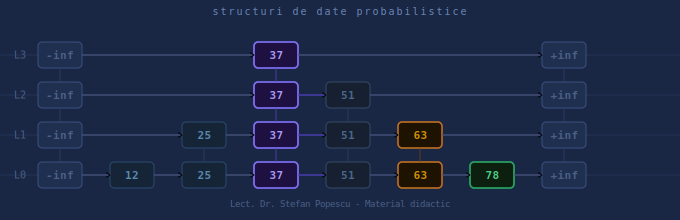

# Skip List Visualizer

> **Material didactic** — suport vizual interactiv pentru cursul de *Structuri de Date și Algoritmi*

**Autor:** Lect. Dr. Ștefan Popescu  
**Scop:** Academic — demonstrarea vizuală a structurii și comportamentului Skip List  
**Format:** Aplicație web single-file, fără dependențe, rulează direct în browser

---

## Despre proiect

Acest vizualizator a fost creat ca **suport de curs** pentru înțelegerea intuitivă a Skip List-ului — o structură de date probabilistică ce permite operații de căutare, inserare și ștergere în timp mediu **O(log n)**.

Aplicația permite studenților să:
- Observe pas cu pas cum funcționează algoritmii de căutare, inserare și ștergere
- Înțeleagă mecanismul de promovare probabilistică pe niveluri
- Experimenteze cu diferiți parametri (probabilitate, valori) și să observe impactul lor
- Exporte structura curentă ca diagramă TikZ pentru includerea în lucrări LaTeX

---

## Ce este un Skip List?

Un **Skip List** este o structură de date probabilistică organizată pe mai multe niveluri de liste înlănțuite:

- **Nivelul 0** — lista completă, sortată, cu toate elementele
- **Nivelurile superioare** — subseturi din ce în ce mai rare, funcționând ca „benzi rapide"

La inserare, un element este promovat la niveluri superioare prin aruncarea unui „ban" (probabilitate configurabilă `p`). **Regula implementată:** promovarea se oprește cel mult la primul nivel nou creat — adică cel mult un nivel nou per inserție.

Complexitate medie: **O(log n)** pentru căutare, inserare și ștergere.

---

## Funcționalități

### Operații
| Operație | Descriere |
|----------|-----------|
| **Inserare** | Inserează o valoare cu promovare probabilistică |
| **Căutare** | Caută o valoare și animează traseul parcurs |
| **Ștergere** | Elimină o valoare și reface pointerii pe toate nivelurile |

### Inserare rapidă
- **Aleatoriu** — o valoare aleatoare (0–199)
- **Lot ×10** — 10 valori aleatoare deodată
- **Sortat ×10** — 10 valori consecutive, pentru demonstrarea comportamentului pe date ordonate

### Vizualizare animată
Animația de căutare distinge vizual 4 stări:

| Culoare | Semnificație |
|---------|-------------|
| 🟣 Indigo | Nodul activ examinat în pasul curent |
| 🔵 Lavandă | Noduri deja vizitate (urmă) |
| 🟠 Portocaliu | Nodul blocker — prea mare, algoritmul coboară un nivel |
| 🟢 Verde | Nodul curent la coborârea de nivel / nodul găsit |

### Moduri de animație
- **Automat** — animație continuă cu viteză reglabilă (1× – 5×)
- **Pas cu pas** — butonul „Următor" avansează câte un pas, ideal pentru prezentări la curs

### Parametri configurabili
- **Probabilitate de promovare `p`** — slider 0.10 – 0.90
- **Viteză animație** — slider 1× – 5×

### Export
| Format | Utilizare |
|--------|-----------|
| **JSON** | Salvează/restaurează starea curentă |
| **PNG** | Captură curată pentru prezentări și documentație |
| **TikZ** | Cod LaTeX compilabil direct — pentru includerea în lucrări și prezentări Beamer |

---

## Utilizare

Fișierul `skiplist.html` este complet autonom — nu necesită instalare, server sau dependențe.

### Local
```bash
git clone https://github.com/USER/skiplist-visualizer.git
open skiplist.html
```

### GitHub Pages (link public)
1. **Settings → Pages → Branch: main → / (root) → Save**
2. Accesează: `https://USER.github.io/skiplist-visualizer/skiplist.html`

---

## Export TikZ

Codul generat este un document LaTeX standalone compilabil cu `pdflatex` sau în **Overleaf**:

```latex
\documentclass{standalone}
\usepackage{tikz}
\usepackage{amsmath}
\usetikzlibrary{arrows.meta, positioning}

\begin{tikzpicture}[
  datanode/.style={rectangle, draw=cyan!60!black, fill=cyan!8, ...},
  sentinel/.style={rectangle, draw=orange!70!black, fill=orange!8, ...}
]
  % noduri, sageti orizontale, conectori verticali, etichete niveluri
\end{tikzpicture}
```

```bash
pdflatex skiplist.tex
```

---

## Structura fișierului

```
skiplist.html
├── <style>        CSS — tema light, layout, animatii
├── HTML           Interfata: controale, canvas, jurnal, parametri
└── <script>
    ├── SkipNode   Clasa nod (val, forward[])
    ├── SkipList   Algoritmi: insert, search, delete, serialize
    ├── Renderer   Canvas 2D: draw, collectNoduri, drawNode, drawArrow
    ├── Animator   animatePath, stepNext, resetAnim, toggleStepMode
    ├── Operations doInsert, doSearch, doDelete, bulk helpers
    └── Export     exportJSON, importJSON, exportPNG, exportTikZ
```

---

## Scurtături tastatură

| Tastă | Acțiune |
|-------|---------|
| `R` | Inserare aleatoare rapidă |
| `Enter` (în input) | Execută operația curentă |
| `Esc` | Închide modalele |

---

## Tehnologii

- **HTML5 Canvas** — rendering 2D al structurii
- **Vanilla JavaScript** — fără framework, fără build step
- **Google Fonts** — `JetBrains Mono` + `Orbitron`
- **CSS custom properties** — temă consistentă

---

## Licență

MIT — liber de utilizat și adaptat în scop educațional, cu menționarea autorului.

---

*Lect. Dr. Ștefan Popescu — Facultatea de Informatică*
